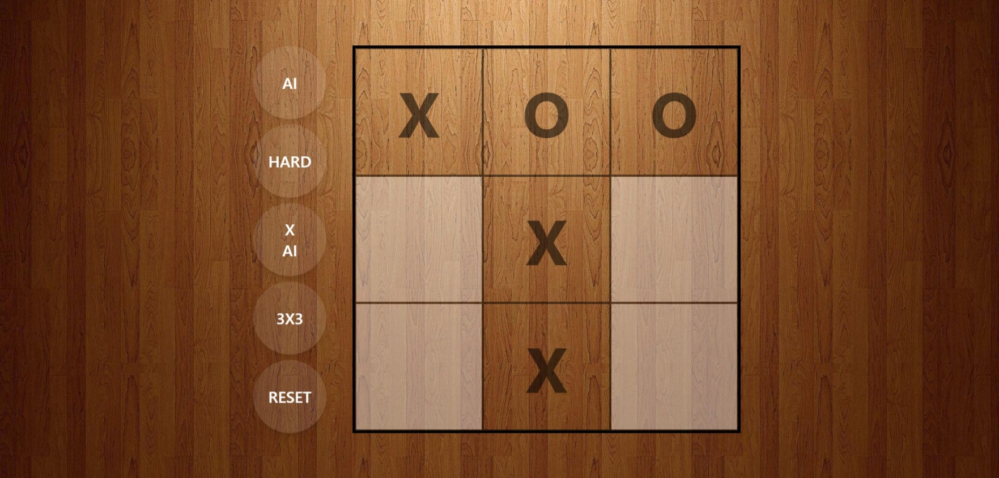
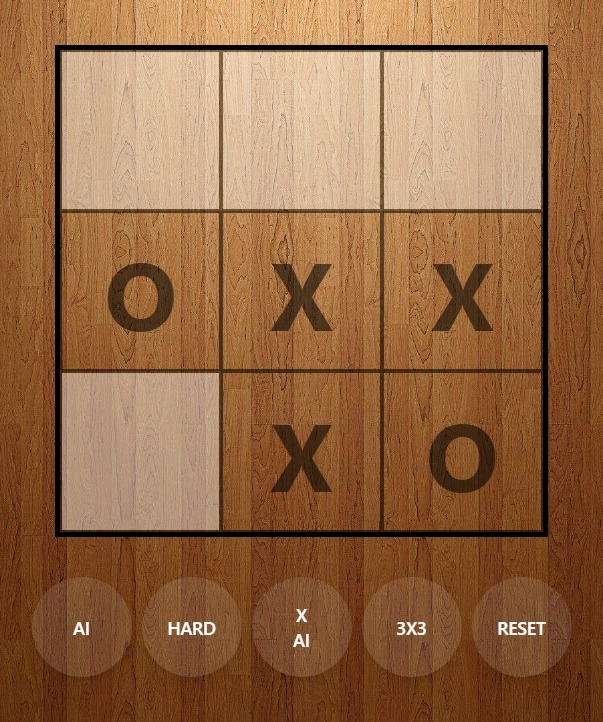
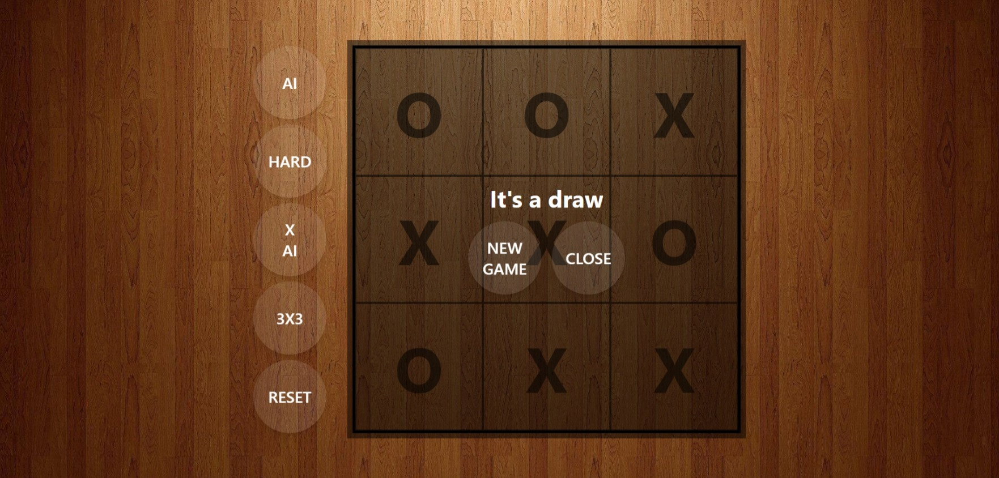
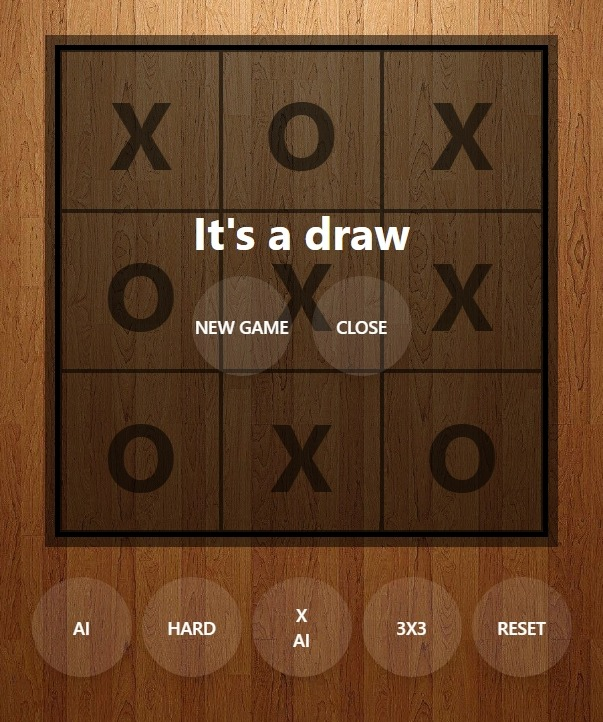

# Tic Tac Toe

A configurable, AI-powered Tic Tac Toe web app. Play against another human or against an AI opponent, on a 3x3, 4x4, or 5x5 board, with two difficulty levels. Built with a Flask backend, a vanilla JavaScript frontend, and Tailwind CSS for styling.




## Features

- **Configurable board size**: 3x3, 4x4, or 5x5, switchable at any time.
- **Two play modes**: Local two-player (human vs. human) or single-player against an AI opponent.
- **Two AI difficulties:**
  - **Medium**: Rule-based: takes a winning move if available, blocks the opponent's winning move, otherwise falls back to strategic positioning (center, then corners, then random).
  - **Hard**: Minimax search with alpha-beta pruning, move ordering, and a transposition table. Plays optimally on 3x3. On larger boards, search depth adapts based on how many cells remain empty, with a positional heuristic used once the depth cap is reached, keeping response times reasonable without sacrificing too much playing strength.
- **Configurable symbol assignment**: Choose whether the AI plays X or O; whichever side X is, that player moves first.
- **Persistent settings**: Play mode, difficulty, symbol assignment, and board size are all saved to `localStorage` and restored on page load.
- **In-page dialogs**: Custom-styled confirmation dialogs (not browser-native `confirm()`) for resetting the game, changing the board size mid-game, and announcing a win/draw with a "New Game" option.
- **Turn-locking**: The board is disabled while the AI is "thinking" (waiting on a backend response) and after a game ends, preventing out-of-turn or post-game clicks.
- **Responsive layout**: Built with Tailwind CSS, with a background image and a responsive control panel that switches between a row and column layout depending on viewport width.




## Tech Stack

| Layer | Technology |
|---|---|
| Backend | Python, Flask |
| AI logic | Pure Python (minimax with alpha-beta pruning) |
| Frontend | Vanilla JavaScript (no framework) |
| Styling | Tailwind CSS (compiled via PostCSS) |
| Persistence | Browser `localStorage` |
| Type checking | JSDoc + TypeScript's `checkJs` (via `jsconfig.json`) |


## Project Structure

```
tic_tac_toe/
├── app.py                     # Flask app entry point and API route
├── requirements.txt           # Python dependencies
├── .gitignore
├── logic/                     # AI and game-rule logic (Python)
│   ├── __init__.py
│   ├── check_winner.py        # Win-condition checking
│   ├── minimax.py             # Minimax search with alpha-beta pruning
│   └── ai_move.py             # Medium/Hard move selection
├── templates/
│   └── index.html             # Main page template
├── static/
│   ├── assets/
│   │   └── img/
│   │       ├── background.jpg
│   │       └── tic-tac-toe.png
│   ├── js/
│   │   ├── jsconfig.json      # Shared type-checking config across JS files
│   │   ├── storage.js         # localStorage helpers (save/load options)
│   │   ├── gameLogic.js      # Pure win/draw checking (no DOM, no network)
│   │   ├── aiClient.js       # Backend communication (fetch AI moves, read settings)
│   │   ├── dialog.js          # Reusable confirm-style dialog (Promise-based)
│   │   ├── board.js           # Board sizing, creation, and DOM state reading
│   │   ├── cellEvents.js     # Game controller: turn state, click handling, game flow
│   │   └── controls.js        # Control buttons: cyclic toggles, reset, wiring
│   └── styles/
│       ├── package.json
│       ├── package-lock.json
│       ├── tailwind.config.js
│       ├── postcss.config.mjs
│       ├── styles.css         # Tailwind source file
│       └── output.css         # Compiled CSS (generated, served to the browser)
└── venv/                       # Python virtual environment (not committed)
```


## Getting Started

### Prerequisites

- Python 3.10+
- Node.js and npm (for compiling Tailwind CSS)

### Installation

1. **Clone the repository and create a virtual environment:**
   ```bash
   python -m venv venv
   source venv/bin/activate   # on Windows: venv\Scripts\activate
   ```

2. **Install Python dependencies:**
   ```bash
   pip install -r requirements.txt
   ```

3. **Install frontend dependencies and build the CSS:**
   ```bash
   cd static/styles
   npm init -y
   npm install tailwindcss @tailwindcss/postcss postcss
   ```

   For active development, run Tailwind in watch mode instead, so styles rebuild automatically as you edit class names in the HTML.

4. **Run the Flask app:**
   ```bash
   python app.py
   ```


## How to Play

1. Use the **player mode** button to choose between a human opponent or the AI.
2. If playing against the AI, use the **difficulty** button to pick Medium or Hard.
3. Use the **symbol** button to choose whether the AI plays X or O. Whoever plays X always moves first.
4. Use the **board size** button to switch between 3x3, 4x4, and 5x5. Changing the board size mid-game will prompt for confirmation, since it resets the board.
5. Click any empty cell on your turn to place your symbol.
6. When the game ends (win or draw), a dialog appears with the result and a **New Game** option, which resets the board and starts again immediately.
7. The **Reset** button clears the board at any time, with a confirmation prompt if a game is in progress.

## API

The frontend communicates with the backend through a single endpoint:

**`POST /api/ai-move`**

Request body:
```json
{
  "board": [["X", "", ""], ["", "O", ""], ["", "", ""]],
  "aiPlayer": "X",
  "difficulty": "medium"
}
```

Response body:
```json
{
  "position": 5
}
```

`position` is a 1-indexed cell number, counted left-to-right, top-to-bottom (e.g., on a 3x3 board, position `5` is the center cell).

## Architecture Notes

The frontend is deliberately split into small, single-purpose files rather than one large script:

- **`storage.js`** — knows only about `localStorage`. No game logic, no DOM.
- **`game-logic.js`** — pure win/draw-checking functions. No DOM, no network calls.
- **`ai-client.js`** — talks to the Flask backend and reads game settings. No DOM manipulation.
- **`dialog.js`** — a generic, reusable confirm dialog that resolves a `Promise<boolean>`. Has no knowledge of Tic Tac Toe rules at all.
- **`board.js`** — owns the board's DOM structure: sizing, creating cells, clearing, and reading the current board state into a 2D array.
- **`cell_events.js`** — the game controller. Coordinates the other modules: tracks whose turn it is, handles clicks, and decides when to check for a win or ask the AI for a move.
- **`controls.js`** — wires up the option buttons (player mode, difficulty, symbol, board size) and the reset button.

This separation keeps each file testable and replaceable independently — for example, `dialog.js` could be reused in an unrelated project with no changes.

On the backend, `logic/check_winner.py`, `logic/minimax.py`, and `logic/ai_move.py` are organized as a Python package (`logic/`) so their imports remain consistent and importable from `app.py` without path hacks.


